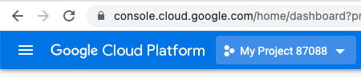
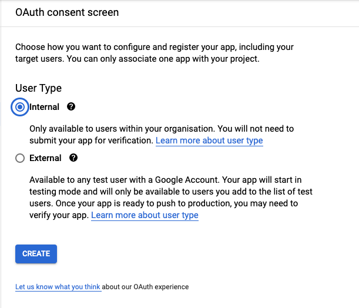
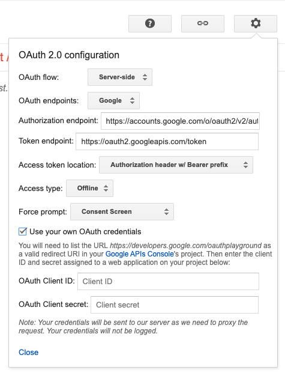
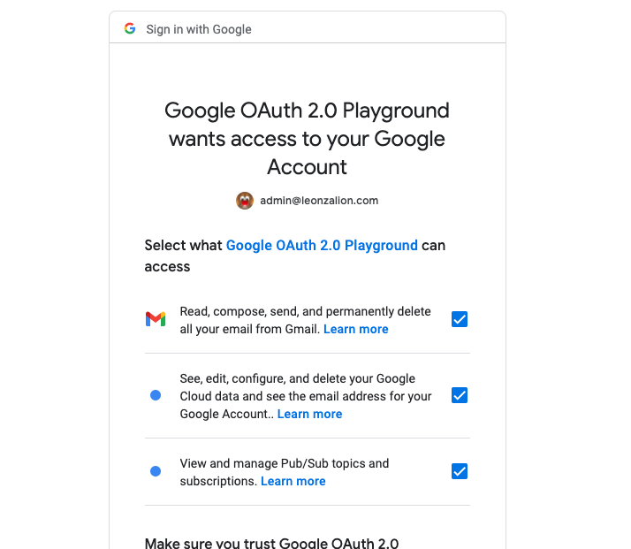

# Discord Email Tunnel

Synchronous text-based communication isn't very efficient, but Discord is a convenient communication platform. This project acts as a proxy/tunnel between Discord messages and emails, allowing you to use your email to communicate with others on Discord.

## Google Cloud Scopes

https://www.googleapis.com/auth/pubsub, https://www.googleapis.com/auth/cloud-platform, https://mail.google.com, https://www.googleapis.com/auth/cloud-platform

## Setup

Clone this project into a folder using git:

```shell
git clone https://github.com/leonzalion/discord-email-tunnel
cd discord-email-tunnel
```

Then, navigate to <https://discord.com/developers/applications> and create a new Discord Application by clicking the _New Application_ button in the top right corner.

Then, once you've created the application, click the _Bot_ button on the sidebar. This should take you to a page with an _Add Bot_ button. Click the _Add Bot_ button to create a new bot.

Once you've added a bot, you should see a _Reset Token_ button under your bot's icon and username. Press this button, and you should see a string of random characters appear. Copy this string into an `.env` file in the root of the `discord-email-tunnel` you just created:

```env
# .env
DISCORD_TOKEN=<paste your token here>
```

Then, log into Google Cloud: <https://console.cloud.google.com/home/dashboard>, and create a new Google Cloud project by visiting <https://console.cloud.google.com/projectcreate>.

Once you've created a project, select it by pressing on this dropdown menu and selecting your project by clicking on it in the popup window:



Then, once you've selected the project, visit this URL to set up the consent screen for the project: <https://console.cloud.google.com/apis/credentials/consent>. This is needed in order to generate the OAuth2 credentials we'll use later on.

Press the radio button next to the "Internal" option, and then click _Create_.



Then, type in a name for your app in the _App name_ textbox (e.g. `Discord Email Tunnel`) and then select your email in the _User Support Email_ box. Then, scroll all the way down and type in your email again under _Developer contact information_. Then, press the _Save And Continue_ button at the bottom.

This should take you to a _Scopes_ screen. You don't need to modify the scopes for this application, so click the "Save and Continue" button at the bottom of the screen.

Finally, this should take you to a summary page, where you can press _Back to Dashboard_ to complete creating the consent screen.

Now, we need to generate OAuth credentials for the application. Start by visiting the following URL: <https://console.cloud.google.com/apis/credentials/oauthclient>

Press the "Application Type" selection box and select "Web Application". You can optionally give a name to this OAuth Client ID (e.g. "Discord Email Tunnel"). Under the authorized redirect URIs section, add the following URL: `https://developers.google.com/oauthplayground/`. Then, click the "Create" button at the bottom of the screen.

This should display a popup containing a Client ID and a Client Secret. Copy the Client ID and the Client Secret into your `.env` file with the keys `GOOGLE_CLOUD_CLIENT_ID` and `GOOGLE_CLOUD_CLIENT_SECRET`. Your `.env` file should now look like the following:

```env
DISCORD_TOKEN=<your Discord token>
GOOGLE_CLOUD_CLIENT_ID=<your Client ID>
GOOGLE_CLOUD_CLIENT_SECRET=<your Client secret>
```

Now, we need to create a refresh token using these credentials. Visit the following URL: <https://developers.google.com/oauthplayground/>.

Press the Settings icon in the top right and check the "Use your own OAuth credentials" checkbox. Then, paste in your client ID and client secret into the "OAuth Client ID" and "OAuth Client secret" textboxes:



Then, press the Settings icon again to close out of the menu. On the bottom left side of the screen, you should see an input box saying "Input your own scopes". Copy-paste the following text into that textbox:

```text
https://www.googleapis.com/auth/pubsub, https://www.googleapis.com/auth/cloud-platform, https://mail.google.com, https://www.googleapis.com/auth/cloud-platform
```

Then, press the "Authorize APIs" button next to the textbox.

This should bring you to the "Choose an account" screen. Here, select the email address you want to use for the Discord Email Tunnel. This will be the email that will programmatically send you emails and receives your emails. For best performance, you should make it the email you use most often because Gmail is smart enough to not send the mail through an SMTP server when you're sending it to yourself, resulting in significantly faster emails.

Then, make sure to select all the checkboxes when you're prompted with the "Google OAuth 2.0 Playground wants access to your Google Account" screen:



Then, scroll to the bottom of the page and press "Continue". You should be taken back to the Google OAuth 2.0 Playground page.

On the left, you should see an "Exchange authorization code for tokens" button. Press this button and copy the value in the "Refresh token" input box. If the sidebar disappears, press the "Step 2 Exchange authorization code for tokens" header to get it back.

Paste this value in your `.env` file with the key `GOOGLE_CLOUD_REFRESH_TOKEN`. Your `.env` file should now look like this:

```text
DISCORD_TOKEN=<your Discord token>
GOOGLE_CLOUD_CLIENT_ID=<your Client ID>
GOOGLE_CLOUD_CLIENT_SECRET=<your Client secret>
GOOGLE_CLOUD_REFRESH_TOKEN=<your refresh token>
```

> This refresh token doesn't expire automatically, so don't worry about having to refresh it in the future (unless it gets leaked)

Now, we've finished gathering the credentials for sending emails. However, we need to also create a service account that can interact with the PubSub API that is used for watching our email inbox and reacting to incoming and sent messages.

// TODO

Give the email `gmail-api-push@system.gserviceaccount.com` access to publishing to your Pub/Sub topic.
